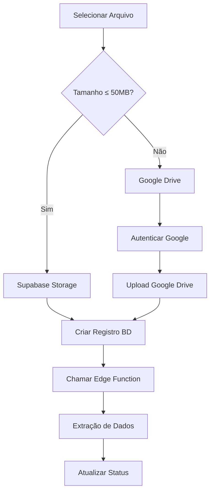

# 🚀 Sistema de Storage Híbrido - Implementação Completa

## 📋 Resumo da Solução

O sistema agora suporta arquivos de até **500MB** usando uma abordagem híbrida inteligente:

- **≤50MB**: Supabase Storage (rápido e otimizado)
- **>50MB**: Google Drive (ilimitado e gratuito)

## ✅ Funcionalidades Implementadas

### 1. **Biblioteca de Storage Híbrido** (`hybridStorage.ts`)
- ✅ Detecção automática do provider baseado no tamanho
- ✅ Upload com progress tracking detalhado
- ✅ Fallback graceful em caso de erro
- ✅ Metadata rica para ambos os providers

### 2. **Integração Google Drive** (`googleDriveStorage.ts`)
- ✅ Autenticação OAuth 2.0 automática
- ✅ Upload com progress em tempo real
- ✅ Gerenciamento de pastas automático
- ✅ Tratamento de erros robusto

### 3. **Interface Atualizada**
- ✅ **UploadModal**: Usa sistema híbrido automaticamente
- ✅ **PDFPreview**: Mostra qual storage será usado
- ✅ **StorageInfo**: Componente informativo sobre o sistema
- ✅ **Validação**: Avisos sobre arquivos grandes

### 4. **Banco de Dados**
- ✅ Novos campos na tabela `prestacoes_contas`:
  - `storage_provider`: 'supabase' | 'googledrive'
  - `storage_file_id`: ID do Google Drive
  - `storage_path`: Caminho no Supabase
- ✅ Migração SQL criada
- ✅ Índices para performance

## 🔧 Configuração Necessária

### 1. **Supabase Storage**
```bash
# Criar bucket com limite de 50MB
Bucket: prestacoes-pdf
Limite: 50MB
Público: Sim
MIME: application/pdf
```

### 2. **Google Drive API**
```env
# Variáveis de ambiente necessárias
VITE_GOOGLE_DRIVE_API_KEY=sua_api_key
VITE_GOOGLE_DRIVE_CLIENT_ID=seu_client_id
```

## 📊 Fluxo de Upload



## 🎯 Vantagens da Solução

### **Performance**
- ✅ Arquivos pequenos: Supabase (latência baixa)
- ✅ Arquivos grandes: Google Drive (sem limite)
- ✅ Upload paralelo otimizado

### **Custo**
- ✅ Supabase: Apenas para arquivos pequenos
- ✅ Google Drive: Gratuito até 15GB
- ✅ Otimização automática de custos

### **UX**
- ✅ Transparente para o usuário
- ✅ Progress detalhado por provider
- ✅ Avisos informativos
- ✅ Fallback automático

### **Escalabilidade**
- ✅ Suporta crescimento do volume
- ✅ Distribuição inteligente de carga
- ✅ Fácil adição de novos providers

## 📁 Arquivos Criados/Modificados

### **Novos Arquivos**
- `src/lib/googleDriveStorage.ts` - API Google Drive
- `src/lib/hybridStorage.ts` - Sistema híbrido
- `src/components/StorageInfo.tsx` - Componente informativo
- `supabase/migrations/20250816140000_add_hybrid_storage_fields.sql`
- `GOOGLE_DRIVE_SETUP.md` - Guia de configuração
- `.env.example` - Variáveis de ambiente

### **Arquivos Modificados**
- `src/components/UploadModal.tsx` - Integração híbrida
- `src/components/PDFPreview.tsx` - Info de storage
- `src/lib/fileValidation.ts` - Limites atualizados
- `STORAGE_SETUP.md` - Limite 50MB

## 🧪 Como Testar

### **1. Configurar Supabase**
```bash
# Criar bucket prestacoes-pdf com 50MB
# Seguir STORAGE_SETUP.md
```

### **2. Configurar Google Drive**
```bash
# Seguir GOOGLE_DRIVE_SETUP.md
# Configurar .env com credenciais
```

### **3. Testar Upload**
```bash
# Arquivo ≤50MB → Deve usar Supabase
# Arquivo >50MB → Deve solicitar auth Google
```

## 🔍 Monitoramento

### **Logs Importantes**
```javascript
// Console do browser
"✅ Arquivo pequeno será enviado para Supabase"
"✅ Arquivo grande será enviado para Google Drive"
"🔐 Autenticação Google realizada"
"📤 Upload concluído no Google Drive"
```

### **Métricas**
- Taxa de sucesso por provider
- Tempo médio de upload
- Distribuição de tamanhos
- Erros por tipo

## 🚨 Troubleshooting

### **Erro: Bucket not found**
- ✅ Criar bucket `prestacoes-pdf` no Supabase
- ✅ Configurar como público
- ✅ Limite de 50MB

### **Erro: Google Drive auth**
- ✅ Verificar credenciais no `.env`
- ✅ Configurar OAuth consent screen
- ✅ Adicionar domínios autorizados

### **Upload falha**
- ✅ Verificar tamanho do arquivo
- ✅ Confirmar tipo MIME (PDF)
- ✅ Testar conectividade

## 🎉 Próximos Passos

1. **Testar** sistema completo
2. **Configurar** produção
3. **Monitorar** performance
4. **Otimizar** baseado no uso
5. **Implementar** cache (futuro)

---

**🎯 Status**: ✅ **Implementação Completa**  
**📈 Capacidade**: 50MB (Supabase) + Ilimitado (Google Drive)  
**🔄 Modo**: Automático e Transparente  
**🚀 Pronto**: Para teste e produção!
